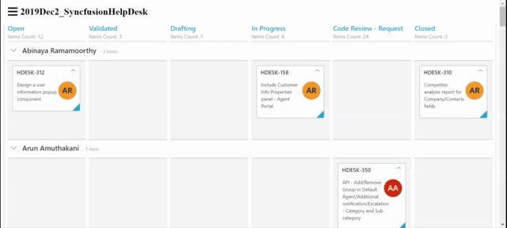

# jirasprintVSsyncfusionkanban



## Repo description

Syncfusion kanban board is replacement for jira sprint board. it can easily configured with Jira Rest Api call in simple steps. syncfusion kanban board had a built in datamanager support it can easily call jira Rest Api and the data can be auto binded to kanban board. 

syncfusion kanban board had a built in customization, if you configure with CURD operation on server side it can ba act like `Task management system` for any organization.

## Setup

```sh

Syncfusion Kanban board API  --> https://help.syncfusion.com/js/kanban/overview

Syncfusion Kanban board Samples  --> https://js.syncfusion.com/demos/web/#!/bootstrap/kanban/defaultfunctionalities

```

```sh

Jira API docs  --> https://developer.atlassian.com/server/jira/platform/rest-apis/

```

```sh

Jira API token generation  --> https://confluence.atlassian.com/cloud/api-tokens-938839638.html

```


## Sample configuration

we should configure `jira-domain` along with `authorization headers(jira token)` to call Jira Api for retriving data's.


---
**NOTE**

If you face any `CORS` issue in browser please refer jira discussion. 

Chrome ext -->  https://chrome.google.com/webstore/detail/allow-cors-access-control/lhobafahddgcelffkeicbaginigeejlf

---
